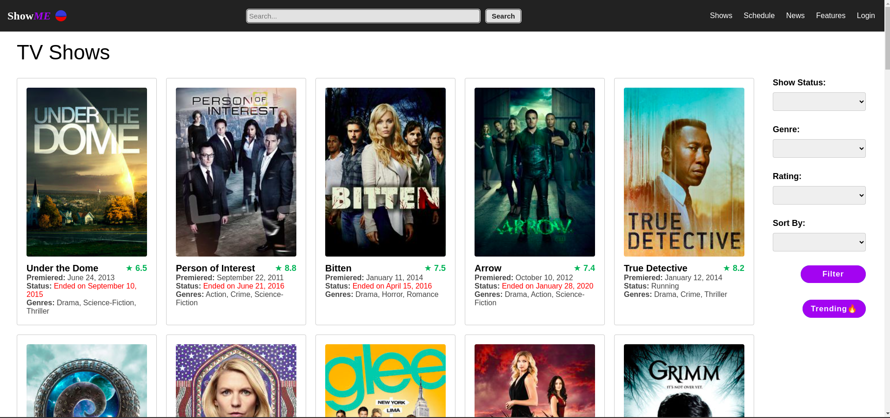
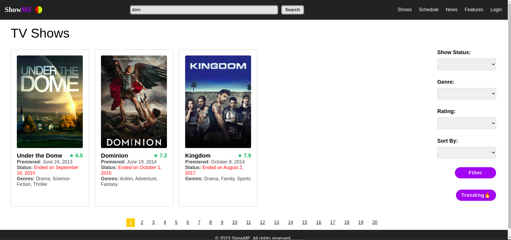
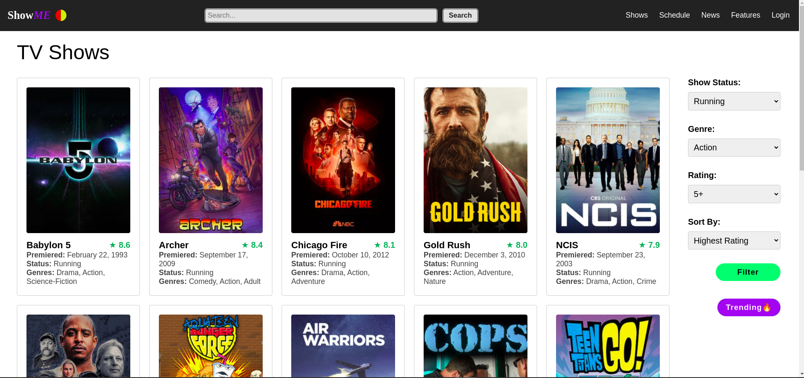
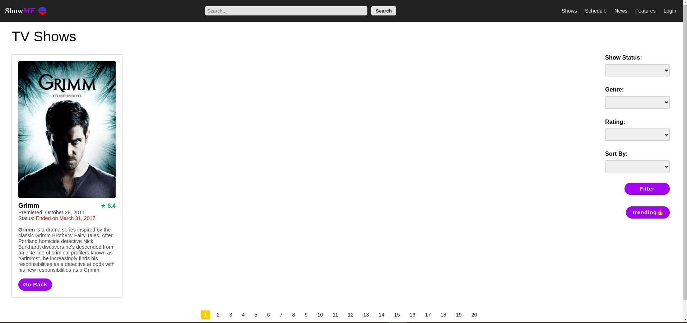
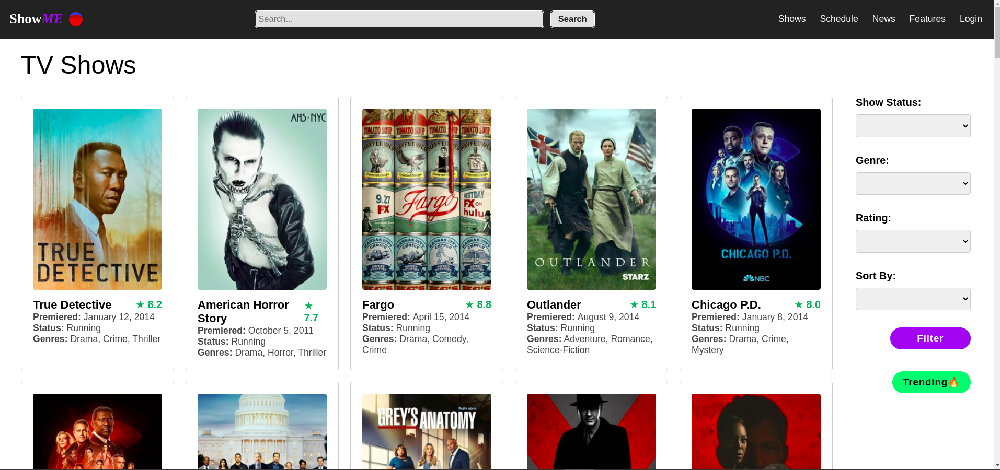
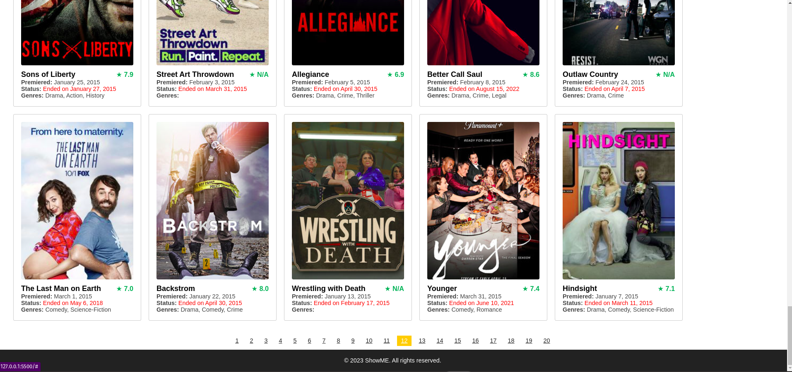

# ShowME : Phase 1 Project

[](https://opensource.org/licenses/MIT)
[](https://www.javascript.com)

## Introduction

ShowMe is a web app for TV Show enthusiasts, built as part of my end of Phase 1 project.

Getting the right TV show to binge for the weekend has never been an easy task. ShowMe laverages the TVMAze API to provide TV show recommendations to users. By integrating with this API, I get access to a vast database of TV show information, including show summaries, genres, and more.

ShowMe provides a search, filter, and sort functionality, enabling users to explore TV Shows based on keywords, genres, etc.

- **Note:**  
  While TVMaze's database is quite versatile, the API lacks several features desired for this project, e.g., filtering or sorting. However, TVMaze allows for a full download of their database. I downloaded and filtered the results to the first 1,000 TV shows of the English languange, which are used for demonstration purposes.

## Project Setup

### Open ShowME deployed via GH Pages

Use this link to directly open the web app deployed via GitHub Pages.

```
https://arshavineroy.github.io//ShowME/
```

### How to use the app

- Browse a list of TV shows from the home page. This shows `title`, `premiere date`, `show's status`, and `genre`.



- Search for a show based on keywords. Exact words or a few letters return a result if found.



- Use the filter section on the right to filter shows or search results based on `status`, `genre`, `rating`.
- Select the desired criteria and click the `filter` button.



- Click on a show to view its `summary`.



- See what's trending by clicking the `trending` button on the homepage.
- This shows currently running shows with a rating of 7 and above.



- Use the page buttons at the bottom to navigate through the pages



- Clicking the `ShowME logo` or the `Go Back` button returns you to the homepage.

#### Alternatively,

### 1. Clone the repository

```
git clone https://github.com/ArshavineRoy/ShowME
```

### 2. Navigate to the project directory

```
cd ShowME
```

### 3. Install and start JSON server

Install the JSON server

```
npm install -g json-server
```

Start JSON Server

```
json-server --watch english-db.json
```

- **Note:** Running this command will instruct `json-server` to use the `english-db.json` file in the terminal's current directory, so make sure to run this command from the same directory as this project.

Test the server by visiting this route in the browser

```
http://localhost:3000/shows
```

Sample:

```json
[
  {
    "id": 1,
    "url": "https://www.tvmaze.com/shows/1/under-the-dome",
    "name": "Under the Dome",
    "type": "Scripted",
    "language": "English",
    "genres": ["Drama", "Science-Fiction", "Thriller"],
    "status": "Ended",
    "runtime": 60,
    "averageRuntime": 60,
    "premiered": "2013-06-24",
    "ended": "2015-09-10",
    "officialSite": "http://www.cbs.com/shows/under-the-dome/",
    "schedule": {
      "time": "22:00",
      "days": ["Thursday"]
    },
    "rating": {
      "average": 6.5
    },
    "weight": 98,
    "network": {
      "id": 2,
      "name": "CBS",
      "country": {
        "name": "United States",
        "code": "US",
        "timezone": "America/New_York"
      },
      "officialSite": "https://www.cbs.com/"
    },
    "webChannel": null,
    "dvdCountry": null,
    "externals": {
      "tvrage": 25988,
      "thetvdb": 264492,
      "imdb": "tt1553656"
    },
    "image": {
      "medium": "https://static.tvmaze.com/uploads/images/medium_portrait/81/202627.jpg",
      "original": "https://static.tvmaze.com/uploads/images/original_untouched/81/202627.jpg"
    },
    "summary": "<p><b>Under the Dome</b> is the story of a small town that is suddenly and inexplicably sealed off from the rest of the world by an enormous transparent dome. The town's inhabitants must deal with surviving the post-apocalyptic conditions while searching for answers about the dome, where it came from and if and when it will go away.</p>",
    "updated": 1631010933,
    "_links": {
      "self": {
        "href": "https://api.tvmaze.com/shows/1"
      },
      "previousepisode": {
        "href": "https://api.tvmaze.com/episodes/185054"
      }
    }
  }
]
```

### Several ways to launch the app

### 4.1. Launch the app using its HTML file

Open `index.html` on your browser, preferably Chrome.

### 4.2. Launch the app using Visual Studio Code

Navigate to the repo directory in the `terminal`, and type `code .` to open the project in VS Code.

- Alternatively, run VS Code and open the project repo folder directly.

### 4.2.2. Install Live Server extension

Open `Extensions` in VS Code `(Ctrl+Shift+X)`, search for `Live Server` by `Ritwick Dey`, and click `Install`.

Open `index.html` and right-click anywehre within the file and select `Open with Live Server` from the context menu.

This will automatically launch a local development server and open the mini app in your default web browser.

## Project Requirements

- The app must be a HTML/CSS/JS frontend that accesses data from a public API. All interactions between the client and the API should be handled asynchronously and use JSON as the communication format. (Alternatively use an Array)

- The entire app must run on a single page. There should be NO redirects. In other words, the project must contain a single HTML file.

- The app must incorporate at least 3 separate event listeners (DOMContentLoaded, click, change, submit, etc).

- Some interactivity is required. This could be as simple as adding a "like" button or adding comments. These interactions do not need to persist after reloading the page.

- Good coding practices. The code must be DRY (Do not repeat yourself) by utilizing functions to abstract repetitive code.

## Author & License

Authored by [Arshavine Waema](https://github.com/ArshavineRoy).

Licensed under the [MIT License](LICENSE) - see the [LICENSE](LICENSE) file for details.
